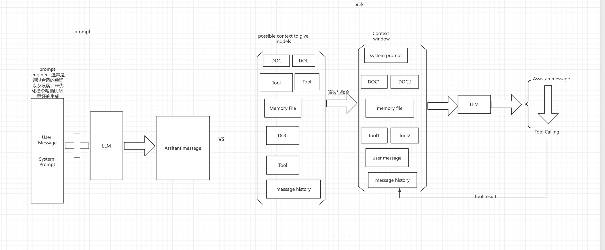
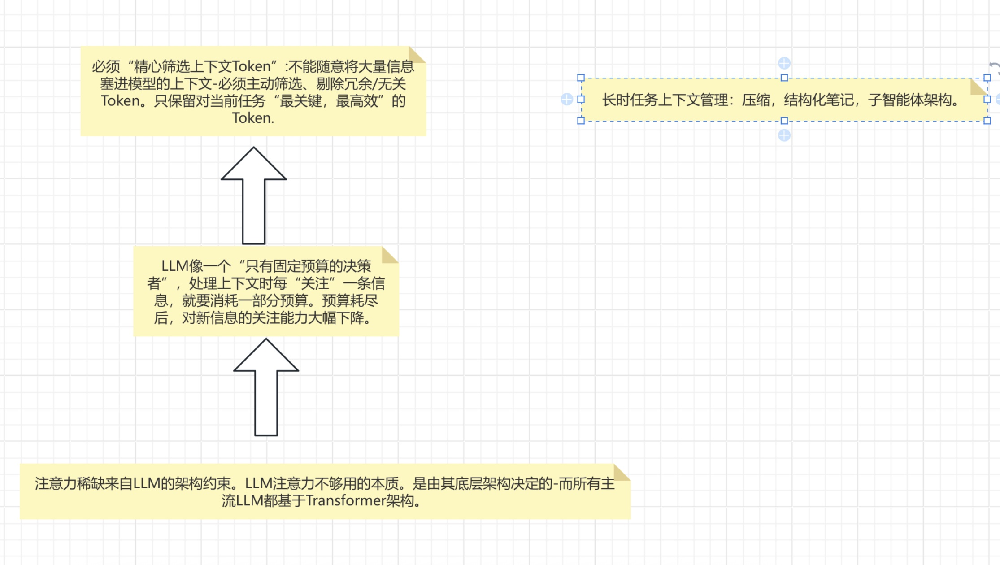

# Context engineering vs. prompt engineering

## prompt engineering

prompt 工程师主要关于书写以及组织LLM指令，让LLM有更好的输出

## context engineering

context 指模型进行“推理（生成回答，分析问题）”时可调用的所有信息集合-相当于模型“思考时能参考的材料库”，直接影响推理结果的准确性和相关性。Tokens LL M处理文本的最小单元。上下文工程就像“给模型准备”参考资料的方法论。目的是让模型拿到“最有用的资料”。从而做出更准确的判断，生成更好的结果。核心动作是“curating and maintaining”.Curating根据具体任务主动筛选“有用的信息”。并将其整理成模型高校读取的形式。maintaing是在模型推理的整个过程中，持续管理 “上下文信息”—— 比如：当模型推理到一半发现 “参考资料不够” 时，补充新信息；当上下文过长（超过模型 Token 限制）时，删除无效信息；确保上下文始终是 “最新、最精简、最相关” 的

### 为什么context工程师再创建Agents的时候如此重要
LLM像人类一样。随着context window中的token增加。模型处理信息的效率降低。上下文必须被视为边际效益递减的有限资源。与人类有限的工作记忆容量一样。LLM也拥有。
要理解这段文本，需围绕 “大语言模型（LLM）的上下文处理能力限制” 这一核心，拆解 “性能衰减特性”“上下文的资源属性”“注意力预算机制” 三者的逻辑关系，最终指向 “上下文筛选的必要性”：
1. 核心前提：所有 LLM 都存在 “上下文性能衰减”，仅程度不同
文本开篇先明确一个共性现象：“While some models exhibit more gentle degradation than others, this characteristic emerges across all models”
关键术语：“gentle degradation” 指 “平缓的性能衰减”—— 即模型在处理 “长上下文” 时，推理准确性、信息召回率、逻辑连贯性会逐渐下降，但不同模型的衰减速度有差异（比如有的模型处理 1 万字上下文时性能才明显下降，有的在 5000 字时就衰减）。
核心结论：无论模型参数大小、架构差异如何，“上下文越长，性能越可能衰减” 是所有 LLM 的共性特征，没有例外。
这一前提否定了 “‘更好的模型’能无限制处理长上下文” 的误区 —— 即使是先进模型，也无法突破 “长上下文导致性能下降” 的规律。
2. 核心推论：上下文是 “有限资源”，存在 “边际收益递减”
基于上述前提，文本得出第一个关键推论：“Context, therefore, must be treated as a finite resource with diminishing marginal returns”
有限资源（finite resource）：LLM 处理上下文的能力不是无限的 —— 一方面受 “最大 Token 限制”（比如某模型最大支持 128k Token，超过则无法处理）；另一方面受 “有效处理能力限制”（即使未超 Token 上限，长上下文也会导致性能衰减），因此上下文本质是 “总量和效用都有限的资源”。
边际收益递减（diminishing marginal returns）：这是经济学概念，此处类比上下文的效用规律 ——
当你给模型补充 “第一批关键信息”（如解决问题的核心条件、核心数据）时，模型性能提升非常明显（“边际收益高”）；但随着补充的信息越来越多（尤其是重复、无关、冗余的信息），每新增一条信息带来的性能提升会逐渐减少，甚至可能因信息过载导致性能下降（“边际收益递减，直至为负”）。
例如：给模型解决 “2024 年诺贝尔化学奖” 问题时，先补充 “2024 诺奖化学奖得主姓名”“研究领域”，模型能快速生成准确回答（边际收益高）；若再补充 “2023 年诺奖得主信息”“化学奖历史起源”，这些信息对当前问题的帮助极小，反而可能让模型混淆重点（边际收益递减）。
3. 机制解释：LLM 的 “注意力预算” 类比人类 “工作记忆”
为了让 “上下文有限性” 更易理解，文本用人类认知机制做类比：“Like humans, who have limited working memory capacity, LLMs have an “attention budget” that they draw on when parsing large volumes of context”
人类工作记忆（working memory）：指人类大脑临时存储和处理信息的能力，容量有限（比如普通人一次只能记住 7±2 个数字）—— 若同时接收过多信息，会因 “记不住、理不清” 导致判断失误。
LLM 的注意力预算（attention budget）：这是对 LLM “注意力机制” 的形象化描述。LLM 处理上下文时，会通过 “注意力机制” 分配计算资源 —— 对 “重要信息” 分配更多注意力（如关键词、核心逻辑），对 “不重要信息” 分配更少注意力。但这种 “注意力资源” 总量是有限的，即 “注意力预算”。
简单说：LLM 像一个 “只有固定预算的决策者”，处理上下文时每 “关注” 一条信息，就要消耗一部分预算；预算耗尽后，对新信息的关注能力会大幅下降。
4. 最终结论：必须 “精心筛选上下文 Token”
文本最后将逻辑闭环，指出实践要求：“Every new token introduced depletes this budget by some amount, increasing the need to carefully curate the tokens available to the LLM”
Token 消耗预算：由于 “注意力预算有限”，每新增一个 Token（无论是有效信息还是冗余信息），都会消耗一部分预算 —— 即使是无关 Token，也会占用模型的 “注意力资源”，导致其对关键 Token 的关注不足。
核心要求：精心筛选（carefully curate）：正因为 “Token 会消耗预算” 且 “上下文边际收益递减”，所以不能随意将大量信息塞进模型的上下文 —— 必须主动筛选、剔除冗余 / 无关 Token，只保留对当前任务 “最关键、最高效” 的 Token，让模型的 “注意力预算” 用在刀刃上。
一句话总结
所有大语言模型处理长上下文时都会出现性能衰减（仅速度不同），因此上下文需被视为 “有限资源”—— 其效用会随信息增加而递减；这类似人类有限的工作记忆，LLM 也有 “注意力预算”，每新增一个 Token 都会消耗预算，最终决定了：必须精心筛选上下文 Token，才能让模型高效利用资源、避免性能下降。

非常好的问题——这其实是 Claude Code（以及大多数 LLM 辅助编程工具，比如 Cursor、Windsurf 等）设计理念上的一个关键取舍。我们来详细拆解下，为什么 Claude Code 选择将上下文（context）存储在本地 JSON 文件中，而不是使用数据库（DB）。

🧩 一、Claude Code 的上下文（Context）是什么

Claude Code 的 “context” 主要包括：

当前打开的项目文件信息（文件路径、内容哈希）

模型对话历史（已压缩/截断）

用户操作状态（如选中区域、编辑模式）

Prompt 中的项目结构缓存（如 symbol 索引、依赖关系）

用户偏好或 session 信息

这些数据的特点：

量小（通常几十 KB）

高频读写

与用户的 本地项目强绑定

对性能和延迟非常敏感（尤其是编辑器实时反馈）

🧠 二、为什么使用本地 JSON 文件而不是数据库
1. ⚡ 读写延迟极低、实现简单

JSON 文件可以在毫秒级完成读写；

对编辑器插件（VSCode、JetBrains）来说，使用本地文件意味着不依赖外部服务；

无需数据库驱动或 ORM（避免复杂依赖）。

➡️ 对于一个需要实时响应的智能补全/解释系统，本地 JSON 的读写性能 + 简单性最优。

2. 🔒 数据隐私与安全

Claude Code 明确遵循“不上传用户代码”的原则。
若使用数据库，就意味着：

要决定数据库位置（本地 or 云端）；

若云端存储，需额外的加密/隐私保护机制；

即使是本地数据库（如 SQLite），也更复杂（锁定、文件句柄、损坏恢复）。

➡️ JSON 文件避免这些问题：完全在用户本地可控范围内，符合隐私合规要求。

3. 🧰 易于调试与可视化

JSON 是人类可读格式；

开发者可以直接打开 .claude-context.json 查看当前上下文；

对调试 prompt、分析 Claude 的上下文拼接逻辑极为方便；

可以方便地手动修复损坏或删除重置。

➡️ 这对开发/调试来说比数据库友好得多。

4. 🧩 插件架构的可移植性

Claude Code 是一个跨平台插件系统：

支持 VSCode、JetBrains、Cursor 等 IDE；

各平台的存储接口不统一；

统一使用 JSON 文件意味着无需额外依赖（数据库驱动、平台 API）。

➡️ JSON 是最通用、最可移植的方案。

5. 🧱 数据量小，无需数据库优势

Claude 的上下文一般仅几百到几千行 JSON。

没有复杂的查询；

没有高并发；

没有关系型结构。

➡️ 数据库的索引、查询优化等特性完全用不上，反而是维护负担。

🏗️ 三、什么时候数据库会更合适？

如果 Claude Code 将来进化到：

需要长期存储跨项目上下文；

支持团队协作、共享上下文；

管理数百 MB 的 embedding 索引；

或引入项目知识库（vector store）；

那时可能会：

本地采用 SQLite（轻量数据库）

或使用 嵌入式向量数据库（如 Chroma、Milvus Lite）

但目前为止，Claude Code 的定位仍然是本地单用户智能编辑辅助，所以 JSON 足够。

📚 总结对比表
对比项	本地 JSON	数据库
性能	✅ 极快 (毫秒级)	稍高延迟
部署复杂度	✅ 零依赖	❌ 需要驱动/初始化
数据量	小	可扩展大
可读性	✅ 人类可读	❌ 二进制
隐私	✅ 完全本地	⚠️ 可能涉及同步/加密
适合场景	单机开发工具	多人协作、云同步
🧩 四、可类比系统
工具	上下文存储方式	说明
Claude Code	本地 .claude-context.json	临时状态缓存
Cursor	本地 cursor-history.json	每项目独立存储
Copilot Labs	内存 + 本地缓存文件	不持久化数据库
Replit Ghostwriter	云数据库	因为是在线IDE
Sourcegraph Cody	本地 + 向量数据库（企业版）	支持语义搜索

